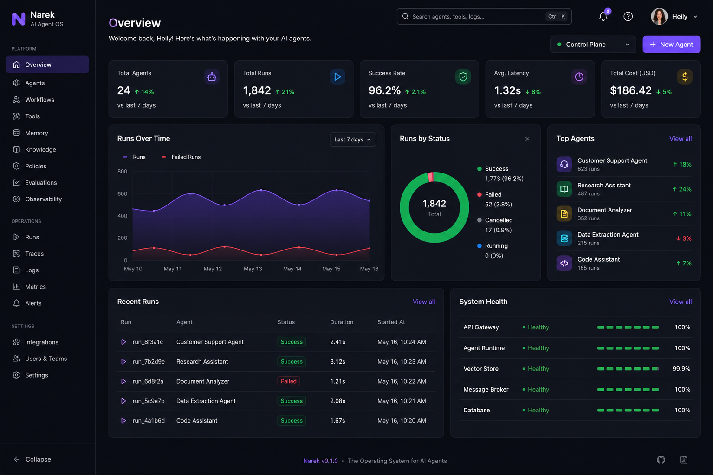
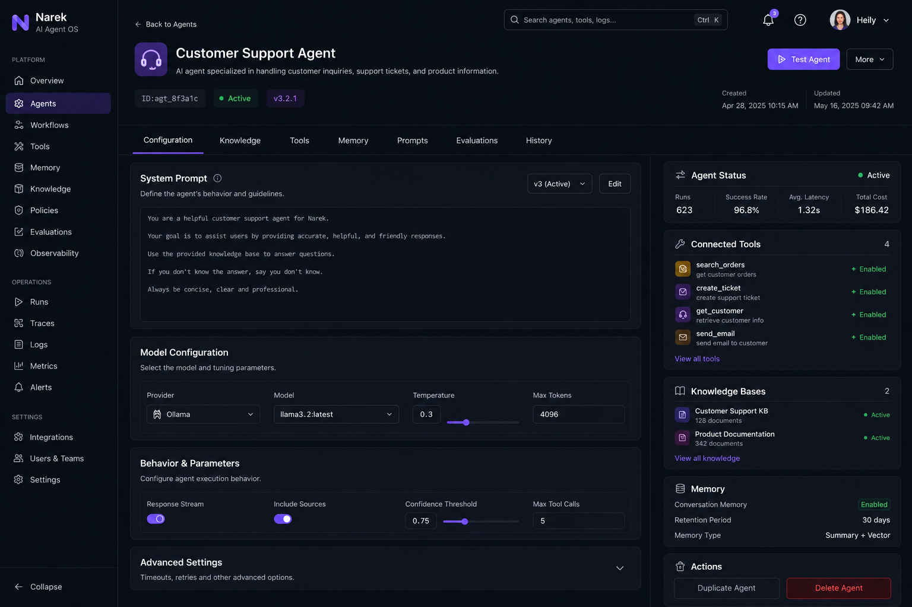
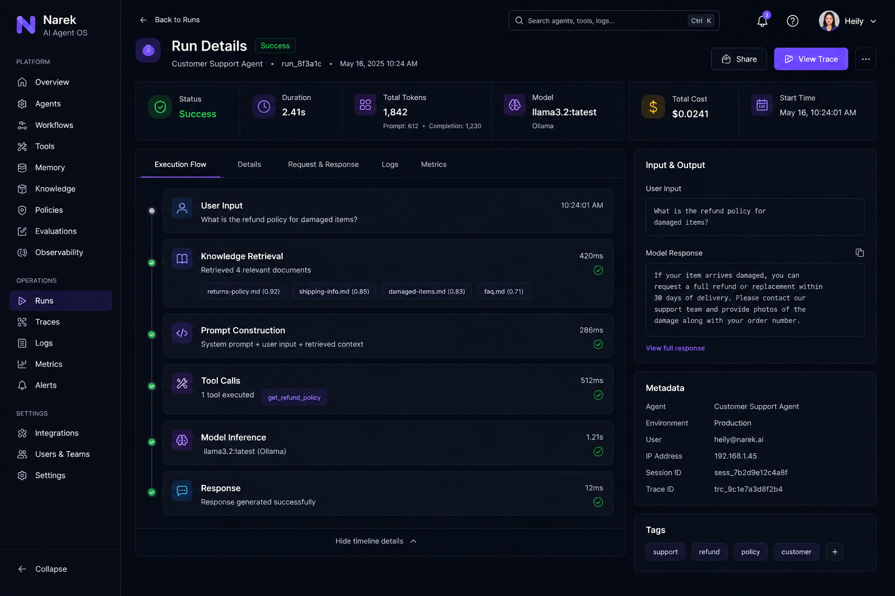

# Narek

> Open-source platform for building, orchestrating and governing enterprise AI agents.

Built with Spring Boot, Spring AI and Angular. Designed for local-first development and enterprise deployment.

<p align="center">
  <br>
  <br>
  
</p>

<p align="center">
  <a href="#documentation">Documentation</a> •
  <a href="#roadmap">Roadmap</a> •
  <a href="#architecture">Architecture</a>
</p>

## Table of Contents

- [Project Status](#project-status)
- [Overview](#overview)
- [Why Narek?](#why-narek)
- [Vision](#vision)
- [Project Goals](#project-goals)
- [Current Milestone](#current-milestone)
- [MVP Scope](#mvp-scope)
- [Non-Goals](#non-goals)
- [Core Features](#core-features)
- [Design Principles](#design-principles)
- [Architecture](#architecture)
- [Technology Stack](#technology-stack)
- [Quick Start](#quick-start)
- [Getting Started](#getting-started)
- [Repository Structure](#repository-structure)
- [Screenshots](#screenshots)
- [Roadmap](#roadmap)
- [Documentation](#documentation)
- [FAQ](#faq)
- [Contributing](#contributing)
- [License](#license)

---

## Project Status

Narek is currently in **early development**. There is no released version yet.

The current milestone focuses on building the core runtime, orchestration layer and dashboard required to execute AI agents locally — see the [Development Roadmap](./docs/development-roadmap.md) for the full implementation plan.

Everything described below as "Planned" or "Future" is design intent, not shipped functionality.

---

## Overview

Narek provides the infrastructure required to run AI agents beyond simple chat interfaces.

Core capabilities include:

- AI agent runtime
- Retrieval-Augmented Generation (RAG)
- Prompt management
- Tool execution
- Memory
- Knowledge management
- Observability

---

## Why Narek?

Most AI projects eventually implement the same infrastructure: runtime, memory, retrieval, prompt management, tool execution, governance and observability.

Instead of rebuilding these capabilities for every AI application, Narek provides them as a reusable platform.

---

## Vision

Narek aims to become the orchestration layer for enterprise AI applications.

Rather than providing a single AI assistant, the platform focuses on delivering the infrastructure required to build, govern and operate AI agents in production environments.

The project follows a local-first approach during development while remaining cloud-agnostic by design.

---

## Project Goals

- Build AI agents, not chatbots.
- Stay provider agnostic.
- Run locally without cloud dependencies.
- Scale towards enterprise environments.

---

## Current Milestone

The current development milestone validates the complete end-to-end execution flow:

```text
User
  │
Dashboard
  │
Agent Runtime
  │
Knowledge Retrieval
  │
Prompt Builder
  │
AI Provider
  │
Execution History
```

This flow is still being built — see [Project Status](#project-status).

---

## MVP Scope

### Target for MVP

- AI agent management
- Local LLM execution through Ollama
- Prompt execution
- Knowledge retrieval and document ingestion
- Vector search (pgvector)
- Basic conversation memory
- Execution history
- Angular management dashboard
- Docker-based local environment

### Planned after MVP

- Policy engine
- Multi-agent workflows
- Plugin SDK
- OpenRouter integration (multi-provider AI access)
- Cost analytics
- Enterprise RBAC

---

## Non-Goals

Narek is not intended to:

- Replace LLM providers
- Train foundation models
- Serve as a standalone chatbot application
- Compete with general-purpose BPM / workflow automation platforms

Instead, it provides the infrastructure required to build and operate AI agents.

---

## Core Features

The following modules represent the planned platform architecture. Status reflects where each module sits on the [roadmap](#roadmap), not current functionality.

| Module | Status | Description |
|---|---|---|
| Agent Runtime | Planned | Executes AI agents and coordinates workflows |
| Dashboard | Planned | Angular management UI |
| Prompt Manager | Planned | Stores and versions prompts |
| Knowledge Base | Planned | Document ingestion and retrieval |
| Memory | Planned | Conversation and execution memory |
| Tool Registry | Future | External tool and API integrations |
| Policy Engine | Future | Governance and access control |
| Observability | Future | Traces, logs, metrics, cost estimation |

---

## Design Principles

- Local-first
- Modular Architecture
- Provider Abstraction
- Cloud Agnostic
- Secure by Default
- Observable by Default

---

## Architecture

<p align="center">
  
</p>

<details>
<summary>Detailed architecture</summary>

```text
                  Angular Dashboard
                          │
                          ▼
                  Spring Boot API
                          │
      ┌───────────────────┼──────────────────┐
      ▼                   ▼                  ▼
 Agent Runtime     Policy Engine      Model Router
      │                   │                  │
      ▼                   ▼                  ▼
Memory Service     Tool Registry     Prompt Manager
      │
      ▼
Knowledge Service
      │
      ▼
Vector Store (pgvector)
      │
      ▼
AI Provider
     │
 ┌───┴────────────┐
 │                │
 ▼                ▼
Ollama         OpenRouter
(Local)         (Future)
```

</details>

<details>
<summary>Future architecture</summary>

```text
Agent Runtime
  │
Policy Engine
  │
Workflow Engine
  │
Plugin SDK
  │
Multi-provider AI
```

</details>

---

## Technology Stack

### Backend

| Technology | Purpose |
|---|---|
| Java 21 | Runtime |
| Spring Boot 3 | API |
| Spring Security | Authentication |
| Spring Data JPA / Hibernate | Persistence |

### Frontend

| Technology | Purpose |
|---|---|
| Angular 20 | Framework |
| TypeScript | Language |
| Angular Material | UI components |
| Angular Signals | State management |
| RxJS | Reactive streams |

### AI

| Technology | Purpose |
|---|---|
| Spring AI | LLM orchestration and provider abstraction |
| Ollama | LLM execution |
| OpenRouter | Multi-provider AI access |

### Infrastructure

| Technology | Purpose |
|---|---|
| Docker / Docker Compose | Environment orchestration |
| PostgreSQL + pgvector | Relational + vector storage |
| Redis | Caching |
| RabbitMQ | Messaging |
| ECS (Fargate) | Container hosting for backend and frontend |
| ECR | Container image registry |
| RDS for PostgreSQL (pgvector) | Managed relational + vector storage |
| ElastiCache for Redis | Managed caching |
| Amazon MQ for RabbitMQ | Managed messaging |
| S3 | Document storage for knowledge base ingestion |
| Application Load Balancer | Traffic routing across services |
| CloudFront | CDN for the Angular dashboard |
| Route 53 | DNS |
| Secrets Manager | API keys and credentials |
| IAM | Access control and service roles |

---

## Quick Start

```bash
git clone https://github.com/yourusername/narek.git
docker compose up -d
./mvnw spring-boot:run
```

```bash
cd frontend
npm install
ng serve
```

Open `http://localhost:4200`.

---

## Getting Started

### Requirements

- Java 21+
- Node.js 20+
- Docker and Docker Compose
- Git

### Clone the repository

```bash
git clone https://github.com/yourusername/narek.git
```

### Start infrastructure

```bash
docker compose up -d
```

Pull a local model (first run only):

```bash
docker exec -it ollama ollama pull llama3.2
```

> Swap `llama3.2` for any model supported by Ollama.

### Run the backend

```bash
./mvnw spring-boot:run
```

### Run the frontend

```bash
cd frontend
npm install
ng serve
```

### Verify installation

```bash
curl http://localhost:8080/actuator/health
```

- Dashboard: `http://localhost:4200`
- API: `http://localhost:8080`

---

## Repository Structure

Target repository layout:

```text
narek/
├── backend/
├── frontend/
├── docker/
├── docs/
└── img/
```

---

## Screenshots

| View | Screenshot |
|---|---|
| Dashboard |  |
| Agent Playground |  |
| Agent Configuration |  |
| Knowledge Base |  |
| Execution & Observability |  |

---

## Roadmap

### MVP

- [ ] Backend (Spring Boot + Spring AI + Ollama)
- [ ] Angular dashboard
- [ ] Authentication
- [ ] Agent runtime
- [ ] Knowledge base (RAG + pgvector)
- [ ] Conversation memory
- [ ] Observability basics

### v0.5

- [ ] Policy engine
- [ ] Tool registry
- [ ] Workflow engine

### v1.0

- [ ] Plugin SDK
- [ ] Multi-agent workflows
- [ ] Cost analytics
- [ ] Provider abstraction

### v2

- [ ] AWS deployment (ECS, RDS, ElastiCache, Amazon MQ)
- [ ] OpenRouter integration (multi-provider AI access)
- [ ] Enterprise RBAC

See the [Development Roadmap](./docs/development-roadmap.md) for implementation-level detail.

---

## Documentation

| Document | Description |
|---|---|
| [Development Roadmap](./docs/development-roadmap.md) | Implementation milestones for contributors and maintainers |

More documents (architecture, API reference, RAG pipeline, local development) will be added under [`docs/`](./docs) as those parts of the platform are built.

---

## FAQ

### Is Narek production ready?

No. The project is currently under active development and does not yet have a stable release.

### Which AI providers are supported?

The MVP targets Ollama for local development. Additional providers are planned after the initial release.

---

## Contributing

Narek is pre-release and evolving quickly. Open an issue before starting on a large pull request so scope can be agreed on first.

---

## License

MIT License.
