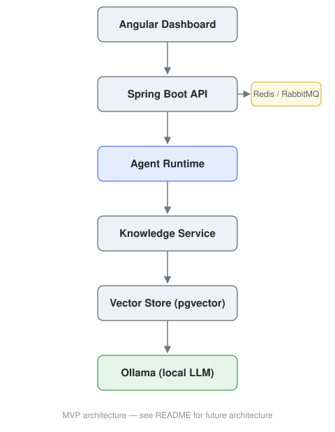

# Narek

> Open-source platform for building, orchestrating and governing enterprise AI agents.

Local-first architecture built with Spring AI and Angular.


<p align="center">
  
</p>

<p align="center">
  <a href="#documentation">Documentation</a> •
  <a href="#roadmap">Roadmap</a> •
  <a href="#architecture">Architecture</a>
</p>

## Table of Contents

- [Project Status](#project-status)
- [Overview](#overview)
- [Why Narek?](#why-narek)
- [Vision](#vision)
- [Current Milestone](#current-milestone)
- [MVP Scope](#mvp-scope)
- [Non-Goals](#non-goals)
- [Core Features](#core-features)
- [Design Principles](#design-principles)
- [Architecture](#architecture)
- [Technology Stack](#technology-stack)
- [Getting Started](#getting-started)
- [Repository Structure](#repository-structure)
- [Roadmap](#roadmap)
- [Documentation](#documentation)
- [Contributing](#contributing)
- [License](#license)

---

## Project Status

Narek is currently in **early development**. There is no released version yet.

The current milestone focuses on building the core runtime, orchestration layer and dashboard required to execute AI agents locally — see the [Development Roadmap](./doc/development-roadmap.md) for the full implementation plan.

Everything described below as "Planned" is design intent, not shipped functionality.

---

## Overview

Narek provides the infrastructure required to run AI agents beyond simple chat interfaces.

The platform combines:

- AI agent runtime
- Retrieval-Augmented Generation (RAG)
- Prompt management
- Tool execution
- Memory
- Knowledge management
- Observability

All components are designed around a modular architecture built with Spring Boot and Angular.

---

## Why Narek?

Most AI projects eventually implement the same infrastructure: runtime, memory, retrieval, tool execution, governance and observability.

Narek aims to provide those capabilities as a reusable platform instead of rebuilding them for every application.

---

## Vision

Narek aims to become the orchestration layer for enterprise AI applications.

Rather than providing a single AI assistant, the platform focuses on delivering the infrastructure required to build, govern and operate AI agents in production environments.

The project follows a local-first approach during development while remaining cloud-agnostic by design.

---

## Current Milestone

The first public milestone focuses on validating the complete execution flow, end to end:

```text
User
  │
Dashboard
  │
Create Agent
  │
Execute Prompt
  │
Retrieve Knowledge
  │
Generate Response
  │
Store Execution
```

Everything in this flow is still being built — see [Project Status](#project-status).

---

## MVP Scope

The initial milestone focuses on validating the core platform end-to-end.

### Target for MVP

- AI agent management
- Local LLM execution through Ollama
- Prompt execution
- Knowledge retrieval and document ingestion
- Vector search (pgvector)
- Basic conversation memory
- Execution history
- Angular management dashboard
- Docker-based local environment

### Planned after MVP

- Policy engine
- Multi-agent workflows
- Plugin SDK
- Azure AI Foundry integration
- Cost analytics
- Enterprise RBAC

---

## Non-Goals

Narek is not intended to:

- Replace LLM providers
- Train foundation models
- Compete with general-purpose workflow automation platforms
- Serve as a standalone chatbot application

Instead, it provides the infrastructure required to build and operate AI agents.

---

## Core Features

The following modules represent the planned platform architecture. Their implementation status is reflected in the [roadmap](#roadmap) below.

| Module | Status | Description |
|---|---|---|
| Agent Runtime | Planned (MVP) | Executes AI agents and coordinates workflows |
| Dashboard | Planned (MVP) | Angular management UI |
| Prompt Manager | Planned (MVP) | Stores and versions prompts |
| Knowledge Base | Planned (MVP) | Document ingestion and retrieval |
| Memory | Planned (MVP) | Conversation and execution memory |
| Tool Registry | Future (v0.5) | External tool and API integrations |
| Policy Engine | Future (v0.5) | Governance and access control |
| Observability | Future (v0.5) | Traces, logs, metrics, cost estimation |

---

## Design Principles

Narek follows a small set of architectural principles:

- Local-first development
- Modular architecture
- Provider abstraction
- Cloud agnostic
- Secure by default
- Observable by default

---

## Architecture

<p align="center">
  
</p>

### Current Target Architecture

```text
Agent Runtime
  │
Policy Engine
  │
Workflow Engine
  │
Plugin SDK
  │
Multi-provider AI
```

<details>
<summary>MVP architecture (text version)</summary>

```text
Angular
  │
Spring Boot API
  │
Agent Runtime
  │
Knowledge Service
  │
Vector Store (pgvector)
  │
Ollama
```

</details>

<details>
<summary>Long-term architecture</summary>

```text
                  Angular Dashboard
                          │
                          ▼
                  Spring Boot API
                          │
      ┌───────────────────┼──────────────────┐
      ▼                   ▼                  ▼
 Agent Runtime     Policy Engine      Model Router
      │                   │                  │
      ▼                   ▼                  ▼
Memory Service     Tool Registry     Prompt Manager
      │
      ▼
Knowledge Service
      │
      ▼
Vector Store (pgvector)
      │
      ▼
AI Provider
     │
 ┌───┴────────────┐
 │                │
 ▼                ▼
Ollama      Azure AI Foundry
(Local)       (Future)
```

</details>

---

## Technology Stack

### Backend

| Technology | Purpose |
|---|---|
| Java 21 | Runtime |
| Spring Boot 3 | API |
| Spring AI | AI integration |
| Spring Security | Authentication |
| Spring Data JPA / Hibernate | Persistence |

### Frontend

| Technology | Purpose |
|---|---|
| Angular 20 | Framework |
| TypeScript | Language |
| Angular Material | UI components |
| Angular Signals | State management |
| RxJS | Reactive streams |

### Infrastructure

| Technology | Purpose |
|---|---|
| Docker / Docker Compose | Local environment |
| PostgreSQL + pgvector | Relational + vector storage |
| Redis | Caching |
| RabbitMQ | Messaging |
| Ollama | Local LLM execution |

---

## Getting Started

Clone the repository:

```bash
git clone https://github.com/yourusername/narek.git
```

Start infrastructure:

```bash
docker compose up -d
```

Pull a local model (first run only):

```bash
docker exec -it ollama ollama pull llama3.2
```

> Swap `llama3.2` for any model supported by Ollama.

Run the backend:

```bash
./mvnw spring-boot:run
```

Run the frontend:

```bash
cd frontend
npm install
ng serve
```

Verify installation:

```bash
curl http://localhost:8080/actuator/health
```

- Dashboard: `http://localhost:4200`
- API: `http://localhost:8080`

---

## Repository Structure

`backend/` and `frontend/` don't exist in this repository yet — this is the target layout as the codebase is built out:

```text
narek/
├── backend/
│   ├── api/
│   ├── application/
│   ├── domain/
│   ├── infrastructure/
│   ├── runtime/
│   ├── memory/
│   ├── knowledge/
│   ├── prompts/
│   ├── tools/
│   ├── policies/
│   └── monitoring/
├── frontend/
│   └── src/
│       └── app/
│           ├── core/
│           ├── shared/
│           ├── features/
│           └── layouts/
├── docker/
├── doc/
└── img/
```

---

## Roadmap

### MVP

- [ ] Backend (Spring Boot + Spring AI + Ollama)
- [ ] Angular dashboard
- [ ] Authentication
- [ ] Agent runtime
- [ ] Knowledge base (RAG + pgvector)
- [ ] Conversation memory
- [ ] Observability basics

### v0.5

- [ ] Policy engine
- [ ] Tool registry
- [ ] Workflow engine

### v1.0

- [ ] Plugin SDK
- [ ] Multi-agent workflows
- [ ] Cost analytics
- [ ] Provider abstraction

### v2

- [ ] Optional cloud deployment
- [ ] Azure AI Foundry integration
- [ ] Multi-provider AI support
- [ ] Enterprise RBAC

See the [Development Roadmap](./doc/development-roadmap.md) for implementation-level detail.

---

## Documentation

| Document | Description |
|---|---|
| [Development Roadmap](./doc/development-roadmap.md) | Implementation milestones for contributors and maintainers |

More documents (architecture, API reference, RAG pipeline, local development) will be added as those parts of the platform are built.

---

## Contributing

Narek is pre-release and evolving quickly. Issues and pull requests are welcome — check the [Development Roadmap](./doc/development-roadmap.md) for the current focus before starting on something large, and open an issue first to discuss scope.

---

## License

MIT License.
